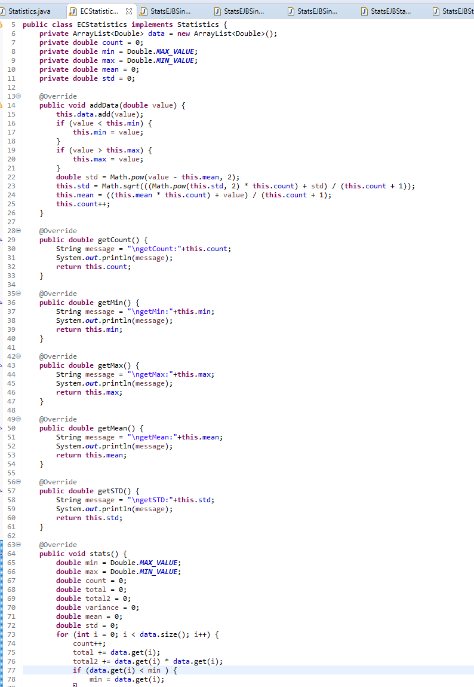
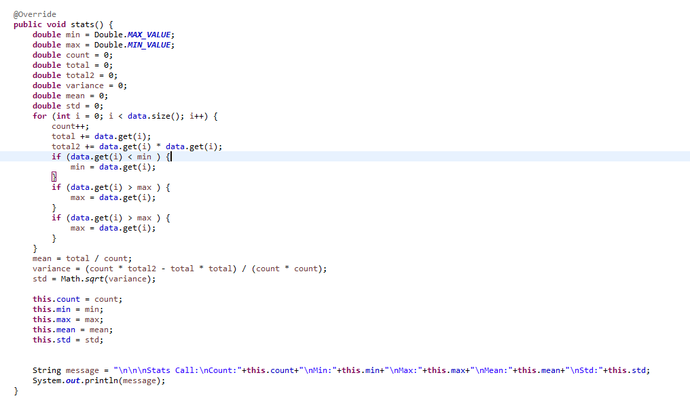
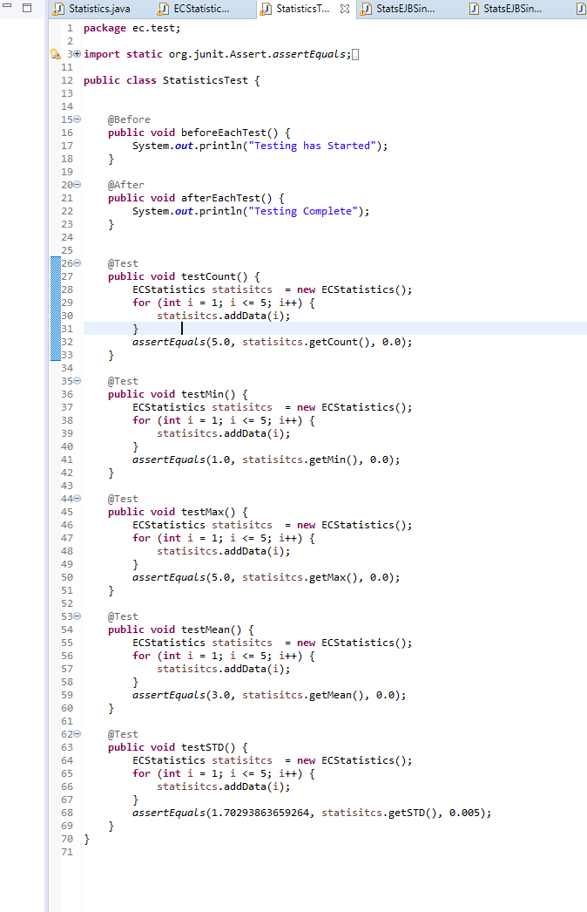
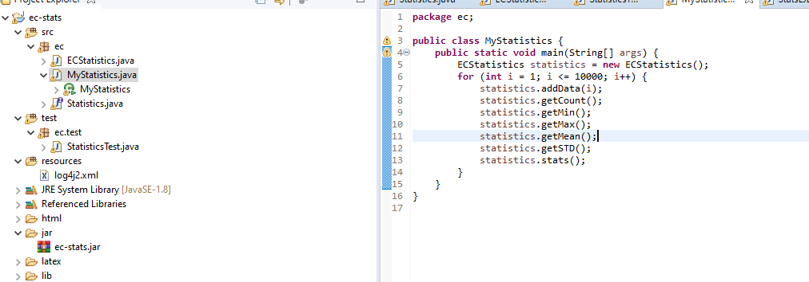
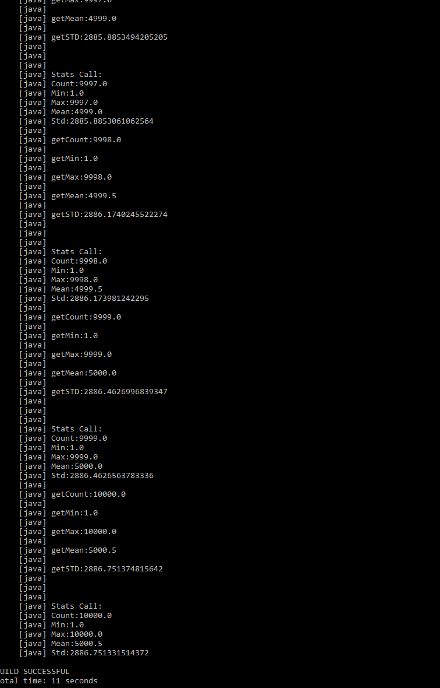
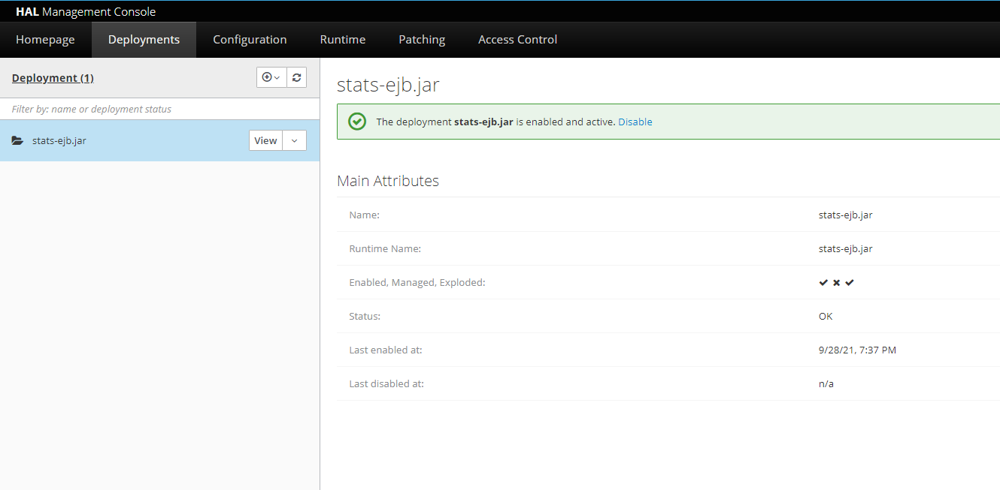
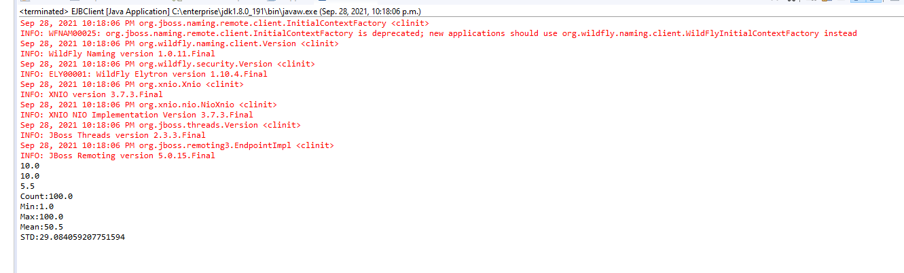

# A1 Report

Author: Josh Barber

Date: Sept 28/ 2021

Check [readme.txt](readme.txt) for lab work statement and self-evaluation.

## Q1 EC story

Write your story here.

I work for a company called Rentsync. We are in the marketing industry where we create websites and services for our clients. We recently rebuilt our framework using newer technologies of Node.js / Koa as our backend framework and Vue.js as our frontend framework.
The unique services we offer deal with apartment rental listings. We list our client’s properties across different platforms and services, such as Kijiji, Facebook, Rentals.ca, etc, where the client just has to manage their data in one designated area within our framework,
our backend service. The client can simply manage the data on the properties that they have that include rental prices per unit for each property, descriptions, amenities, etc. that are stored in our SQL database that then will be synced up with the other services such
as Kijiji etc., as previously mentioned. We deal with a lot of RESTful apis to make sure we are syncing properly with these services, as these services are subject to change their JSON data structures. We have several big clients that use our services, such as Homestead,
Effort Trust, Avenue Living and the list goes on. We are also one of the fastest growing companies in Canada because of our unique service, as it solves many headaches property owners just don’t want to deal with. We also offer other services, such as creating the client’s
websites and also displaying their rental properties there with the details they want.

## Q2 Descriptive statistics project (programming)

### Q2.1 Interface design

Complete? (***Yes***/No)

### Q2.2 Implementation

Complete? (***Yes***/No)

### Q2.3 Unit test

Complete? (***Yes***/No)

### Q2.4 Main program

Complete? (***Yes***/No)

### Q2.5 Logging and documentation

Complete? (***Yes***/No)

### Q2.6 Build by ANT

Complete? (***Yes***/No)

## Q3 Java EE project on stats (programming)

### Q3.1 stats-ejb project

Complete? (***Yes***/No)

### Q3.2 stats-ejb-client project

Complete? (***Yes***/No)

### Q3.3 stats-ejb-web project

Complete? (***Yes***/No)

### Q3.4 stats-ejb-web-ear project

Complete? (***Yes***/No)

**References**

1. CP630OC a1
2. Add your references if you used.
