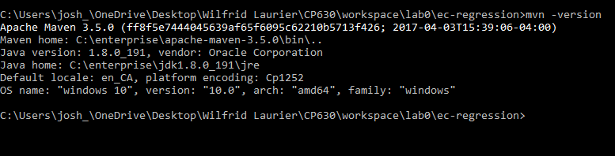
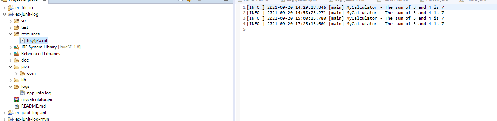
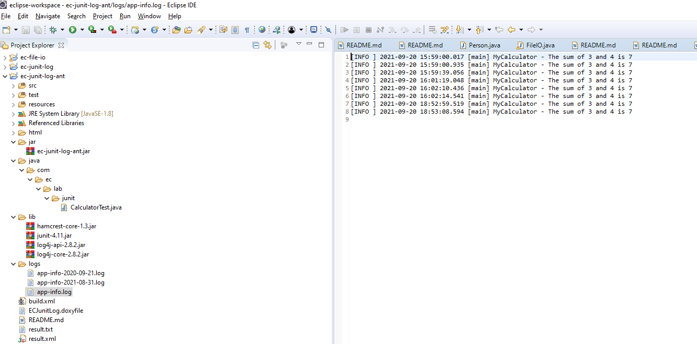
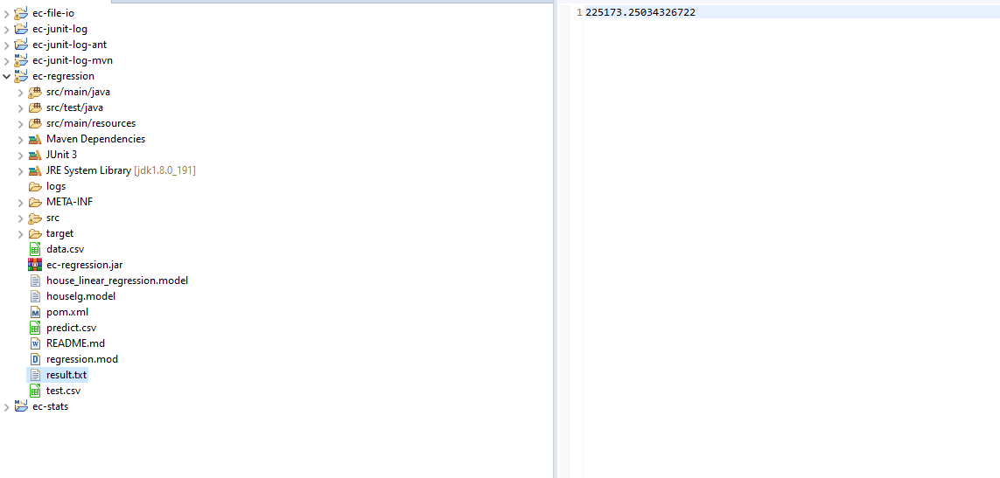

# LAB0 Report

Author: Josh Barber

Date: 2021-09-20

Check [readme.txt](readme.txt) for lab work statement and self-evaluation. 
  
## T1 Java JRE & SDK (lab practice)

### T1.1 Install JRE and JDK

 
Complete? (**Yes**/No) 

If Yes, insert a screen shot image to show the completion.

 {width=90%}

If No, add a short description to describe the issues encountered.
 
## T2 Build tools (lab practice)

### T2.1 Apache Maven
 
Complete? (**Yes**/No) 

If Yes, insert a screen shot image to show the completion.

{width=90%}

If No, add a short description to describe the issues encountered.
 
### T2.2 Apache Ant
 
Complete? (**Yes**/No) 

If Yes, insert a screen shot image to show the completion.

{width=90%}

If No, add a short description to describe the issues encountered.
 
### T2.3 Eclipse JEE
 
Complete? (**Yes**/No) 

If Yes, insert a screen shot image to show the completion.

{width=90%}

If No, add a short description to describe the issues encountered.
 
## T3 Warm up projects (lab practice)

### T3.1 ec-junit-log
 
Complete? (**Yes**/No) 

If Yes, insert a screen shot image to show the completion.

{width=90%}

If No, add a short description to describe the issues encountered.
 
### T3.2 ec-junit-log-ant
 
Complete? (**Yes**/No) 

If Yes, insert a screen shot image to show the completion.

{width=90%}

If No, add a short description to describe the issues encountered.
 
### T3.3 ec-junit-log-mvn
 
Complete? (**Yes**/No) 

If Yes, insert a screen shot image to show the completion.

{width=90%}

{width=90%}

If No, add a short description to describe the issues encountered.
 
### T3.4 ec-file-io
 
Complete? (**Yes**/No) 

If Yes, insert a screen shot image to show the completion.

{width=90%}

If No, add a short description to describe the issues encountered.
 
### T3.5 ec-stats
 
Complete? (**Yes**/No) 

If Yes, insert a screen shot image to show the completion.

{width=90%}

If No, add a short description to describe the issues encountered.

Nothing was listed in the Readme to complete.
 
### T3.6 ec-regression
 
Complete? (**Yes**/No) 

If Yes, insert a screen shot image to show the completion.

{width=90%}

If No, add a short description to describe the issues encountered.
 

**References**

1. CP630OC lab0
2. Add your references if you used. 
