# LAB1 Report

Author: Josh Barber

Date: Sept. 27/2021

Check [readme.txt](readme.txt) for lab work statement and self-evaluation.

## T1 WildFly (JBoss-AS) (lab practice)

### T1.1 JBoss-AS installation

Complete? (***Yes***/No)

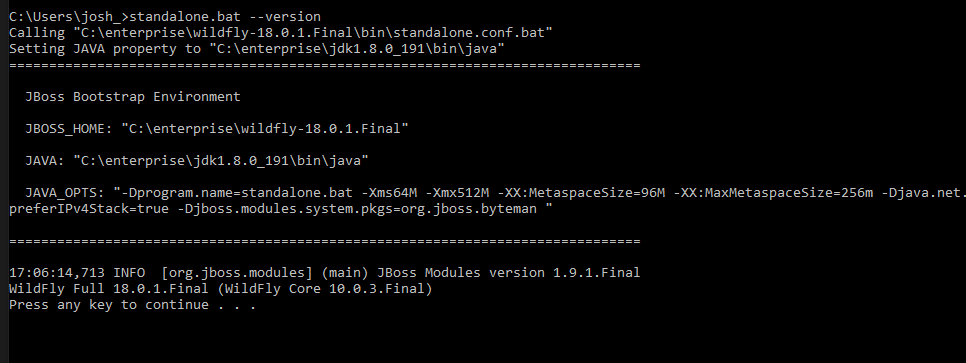

### T1.2 Set admin and user

Complete? (***Yes***/No)

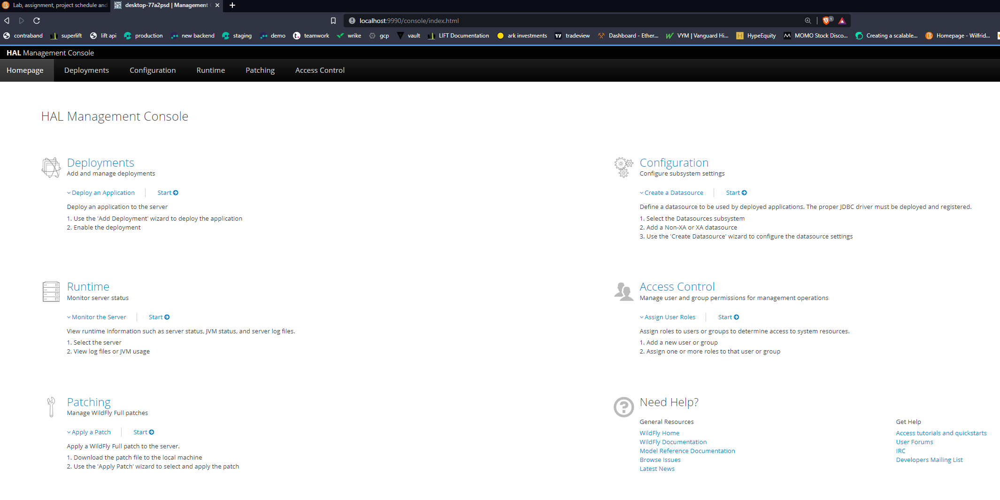

## T2 Build and deploy applications by Maven (lab practice)

### T2.1 Install quickstart projects

Complete? (***Yes***/No)

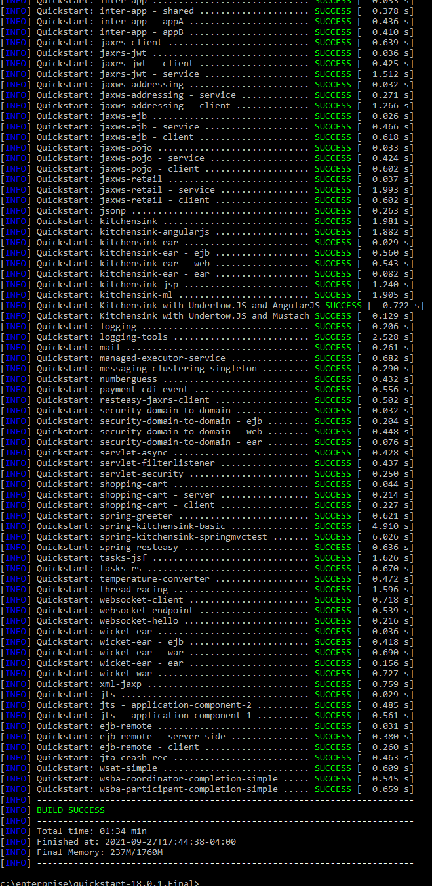
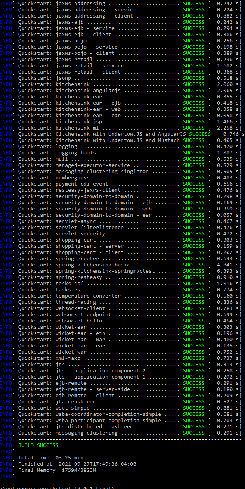

### T2.2 Testing helloworld project

Complete? (***Yes***/No)

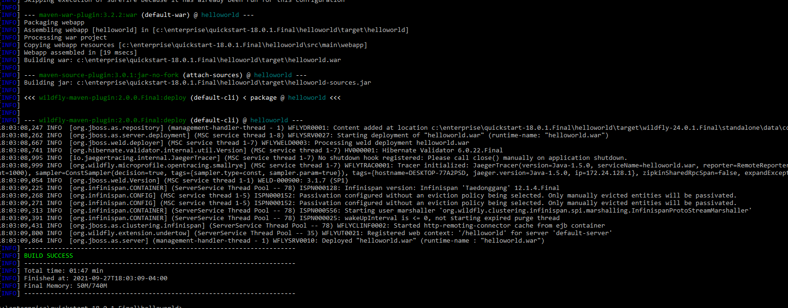
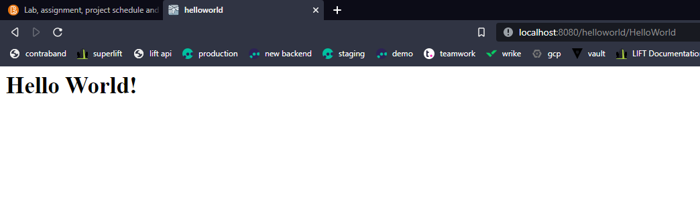

## T3 JBoss-AS Maven on Eclipse JEE (lab practice)

### T3.1 Eclipse Maven and external JBoss

Complete? (***Yes***/No)

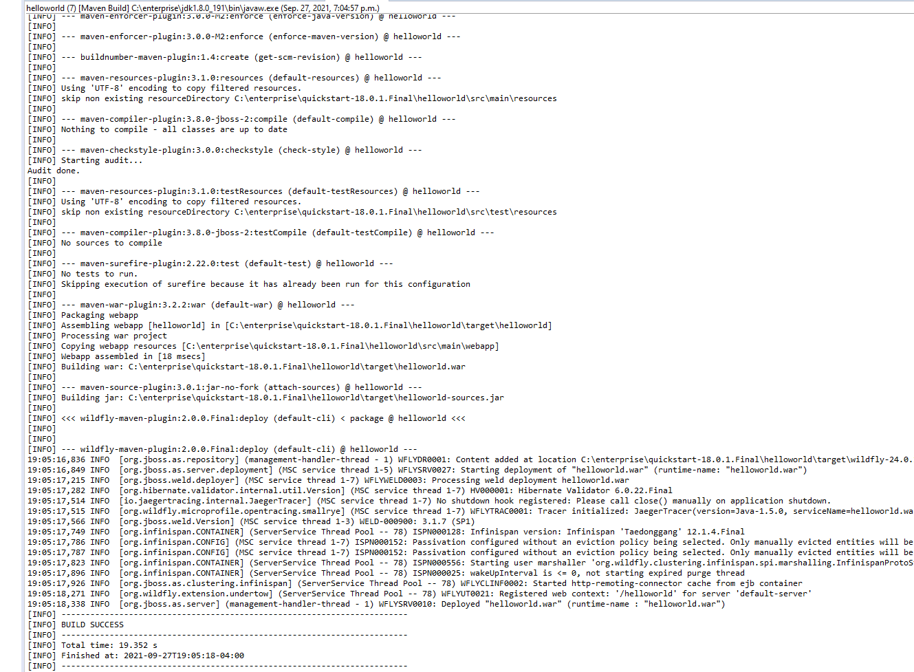

### T3.2 Run WildFly within Eclipse JEE

Complete? (***Yes***/No)

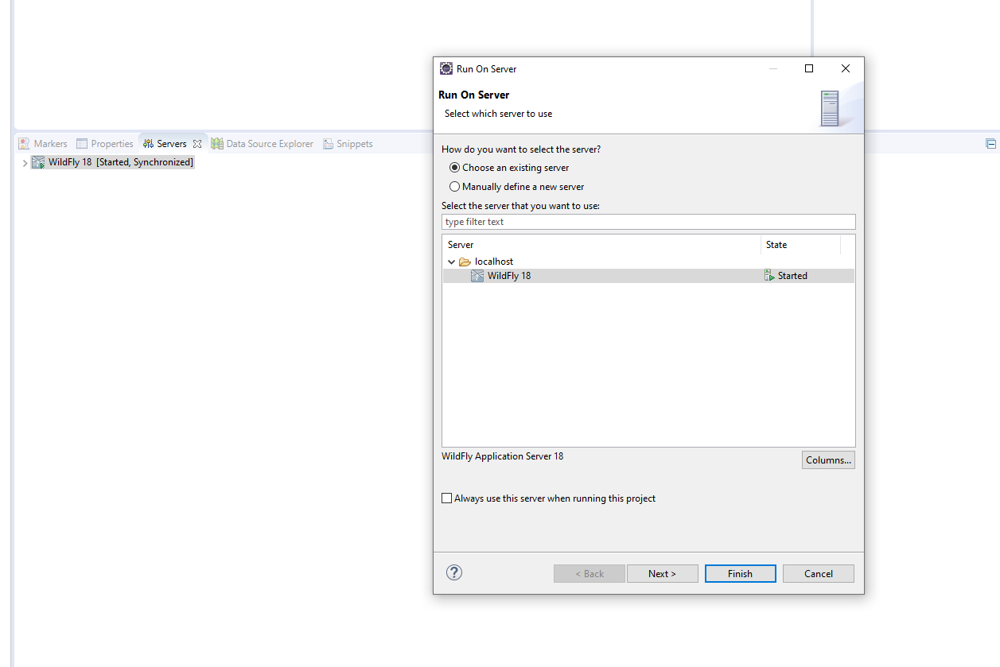
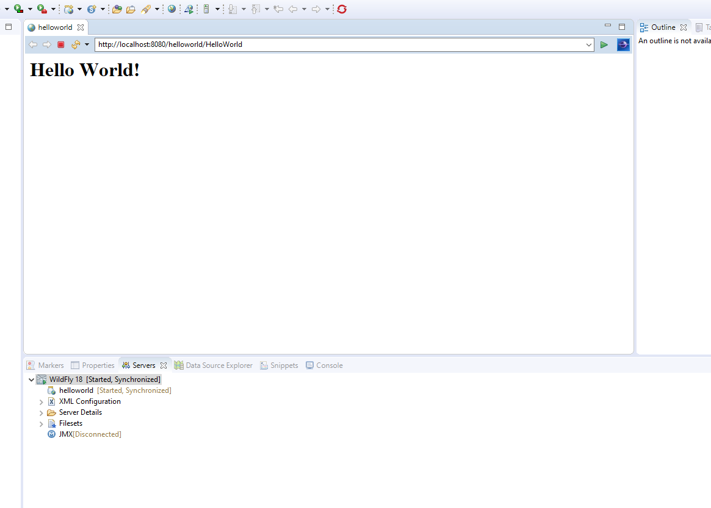

## T4 Hand-on EJB projects (lab practice)

### T4.1 Test ejb-remote project

Complete? (Yes/***No***)

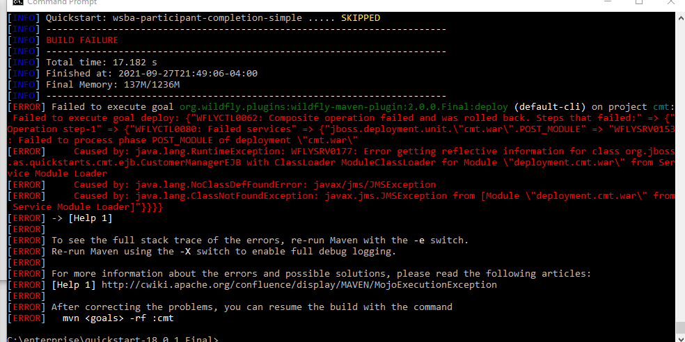

I'm not quite sure what is happening here. The quickstart just cant install cmt for some reason. I've tried to configure the standalone.xml, but no luck.

### T4.2 Create EJB components

Complete? (***Yes***/No)

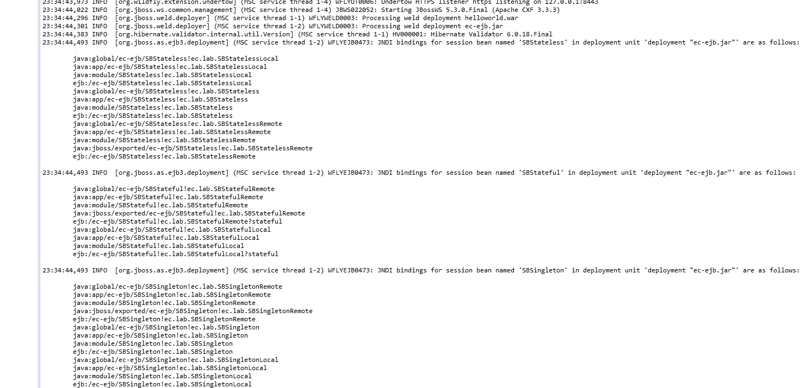

### T4.3 Client component

Complete? (***Yes***/No)

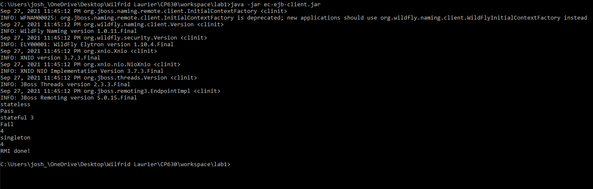

## T5 Hand-on Web component (lab practice)

### T5.1 Web component of Servlet

Complete? (***Yes***/No)

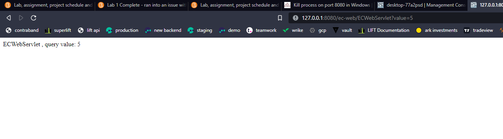
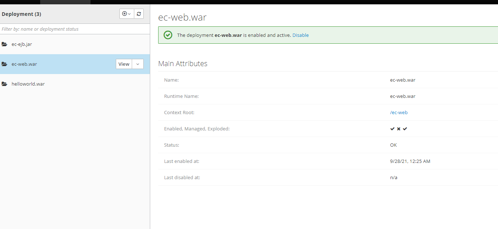

### T5.2 Web components using EJB

Complete? (***Yes***/No)

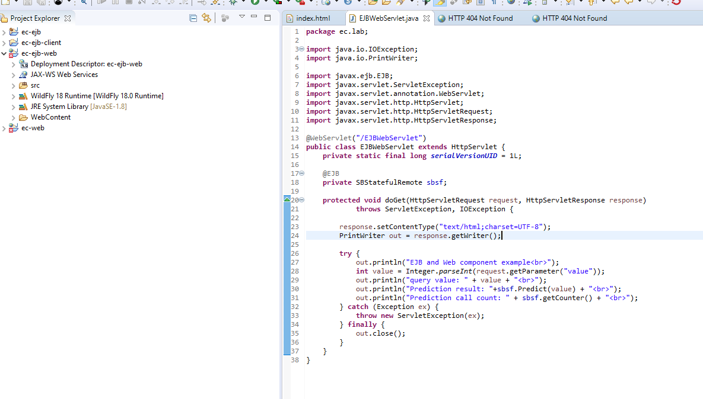

### T5.3 Application component deployment

Complete? (***Yes***/No)

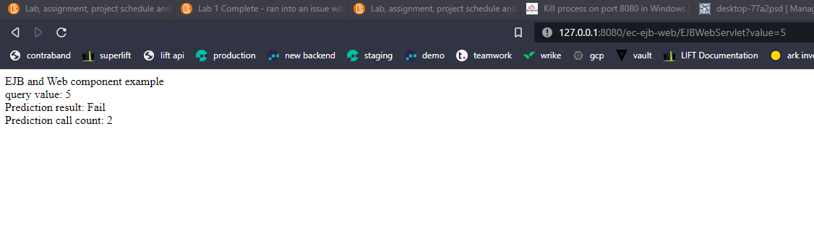

**References**

1. CP630 lab1
2. Add your references if you used.
